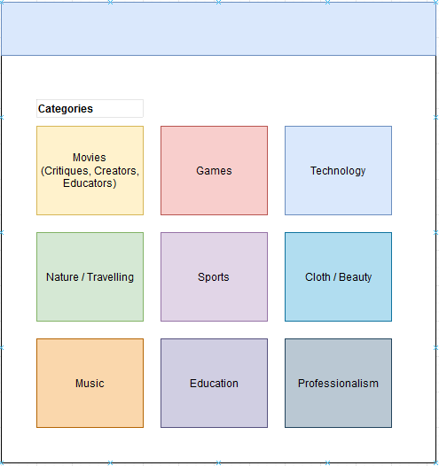
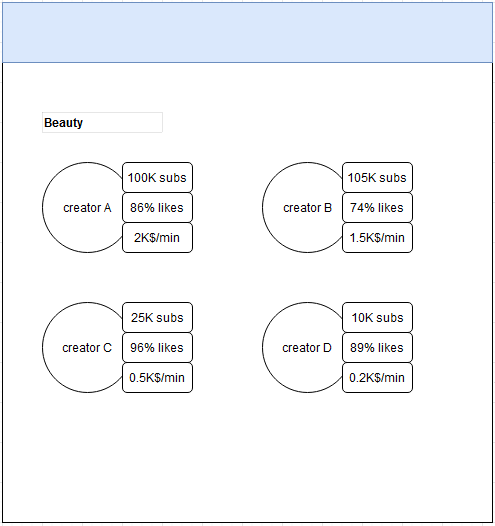

# Sponsoring  Recommendation

## Summary of the project

The purpose of the project is to work in close collaboration with companies that wants to sponsor content creators in exchange of an advertisement of some sort.

### Finding the right content creator

The first thing a sponsor would be looking for is to understand which content creator is the best for their product. A good content creator for a product is:
1. A content creator that has an audience that relates to the product the sponsor is trying to sell.
2. A content creator that has a good feedback from the audience.
3. A content creator that had a good traction with the audience and has an audience that is likely to watch the advertisement.
4. If the sponsorship is mentioned in the comments, what is the sentiment with it?

The first feature of our project is to categorise content creators. In fact, the most important concern for sponsors is to have an audience that will relate to the product and potentially buy it. Then, once in a category, content creators will be rated based on the feedback of the audience on their video, sponsored and not sponsored. 

### Finding if the content creators respected the contract

Now that the content creator and the company agreed on a contract and the video has been made. The content creator should be able to share the video with the company. Once the  video shared, the company can use our second feature to detect if the video satisfies the contract of the advertiser (length, specific content) automatically.

